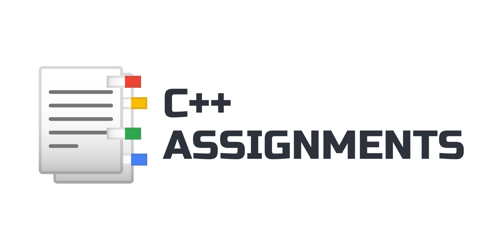

# 📑C++ Assignments

### Collection of all my C++ assignments

  

These are the C++ assignments that I did in 4 years of Enginnering school. 
- All the assignments are done in C++.
- Everything is public and free to use 
- ✨I hope that this helps someone in learning C++✨

 

## Table of Contents

- [2D Arrays](https://github.com/daniel-slosar/cpp-assignments/tree/main/Assignments/2D%20Arrays)
- [Arrays](https://github.com/daniel-slosar/cpp-assignments/tree/main/Assignments/Arrays)
- [For Loops](https://github.com/daniel-slosar/cpp-assignments/tree/main/Assignments/For%20Loops)
- [Functions](https://github.com/daniel-slosar/cpp-assignments/tree/main/Assignments/Functions)
- [Pointers](https://github.com/daniel-slosar/cpp-assignments/tree/main/Assignments/Pointers)
- [Recursion](https://github.com/daniel-slosar/cpp-assignments/tree/main/Assignments/Recursion)
- [Strings](https://github.com/daniel-slosar/cpp-assignments/tree/main/Assignments/Strings)
- [Structs](https://github.com/daniel-slosar/cpp-assignments/tree/main/Assignments/Structs)
- [Vectors](https://github.com/daniel-slosar/cpp-assignments/tree/main/Assignments/Vectors)
- [While Loops](https://github.com/daniel-slosar/cpp-assignments/tree/main/Assignments/While%20Loops)

 

## 📈Usage

All you need to do is just download the whole assignment folder and open in your desired IDE.

 

## 📝License

>[MIT License][mit]

[mit]:https://dillinger.io/
